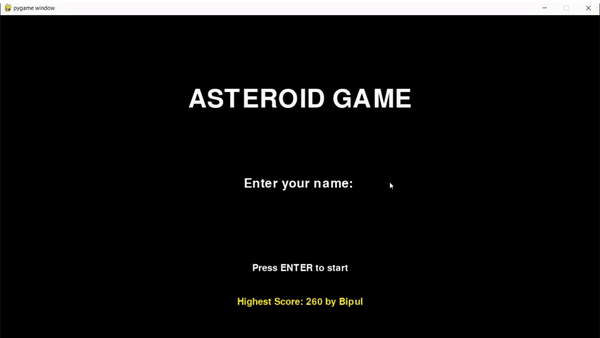
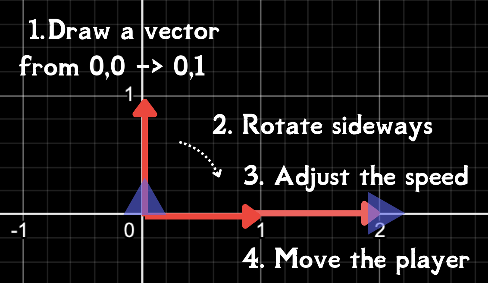
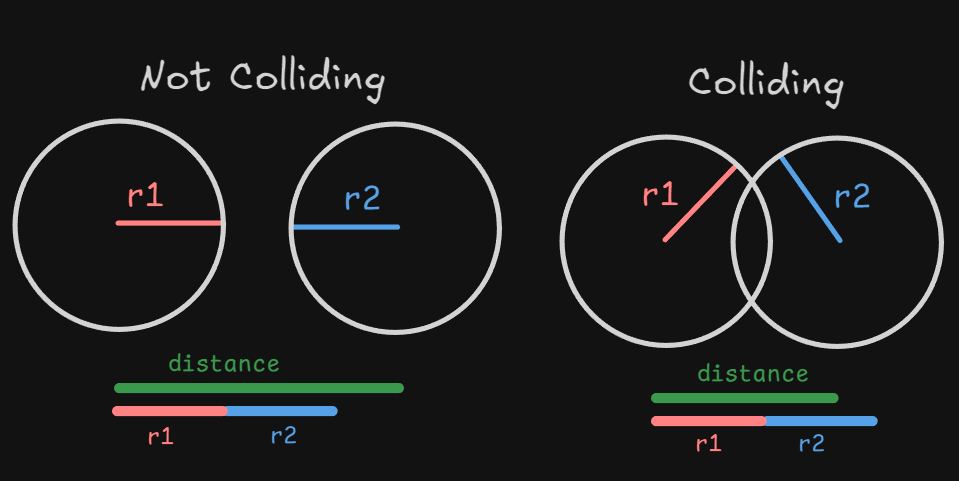
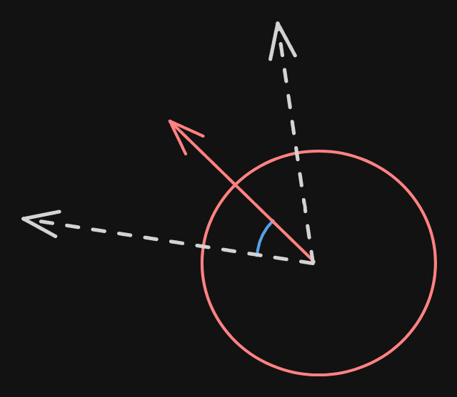
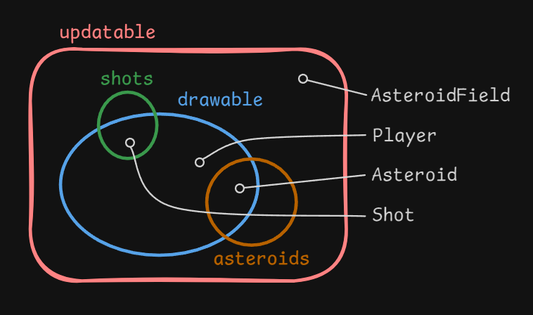

# Asteroids Game

## Overview
Asteroids is an exciting 2D arcade-style space shooter game built using Python and Pygame. The player controls a spaceship that must destroy asteroids by shooting them. The game features smooth player movement, shooting mechanics, collision detection, and asteroid destruction that gets progressively more challenging. Destroying asteroids causes them to break into smaller pieces, increasing the game's difficulty.

The objective is simple: survive as long as possible while avoiding collisions with asteroids and shooting them down. As you progress, the difficulty increases with more asteroids and faster movement.

## Demo

Below is a quick demo of the game in action:



## Features
- **Player Control**: Use keyboard input (e.g., WASD for movement, arrow keys for rotation) to control the spaceship.
- **Bullet Shooting**: Press the spacebar to shoot bullets in the direction the spaceship is facing.
- **Asteroid Destruction**: Destroy asteroids by shooting them; larger asteroids break into smaller ones when destroyed.
- **Collision Detection**: The game detects when bullets hit asteroids or when the spaceship collides with asteroids, triggering a game-over condition.
- **Game States**: The game includes Start, Play, Pause, and Game Over states, allowing you to pause or resume during gameplay.
- **High Score Tracking**: The highest score achieved is saved and displayed, allowing players to try and beat their best performance.
- **Pause/Resume Functionality**: You can pause the game and resume it at any time by pressing the 'P' key.


## Game Logic

### Player Movement
- The player's spaceship is represented as a triangle but uses a hidden circle for collision detection.
- Movement involves:
  - Rotating a unit vector by the player's rotation angle.
  - Scaling the vector by speed and adding it to the position.
  

### Collision Detection
- Both the spaceship and asteroids are treated as circles for simplicity.
- A collision is detected if the distance between two centers is less than or equal to the sum of their radii.


### Asteroid Destruction
- Three asteroid types: **Large**, **Medium**, and **Small**.
- Shooting an asteroid:
  - **Large** → Splits into 2 Medium.
  - **Medium** → Splits into 2 Small.
  - **Small** → Disappears.

---

## Games Group
- Game's groups will look something like this:
 

## Prerequisites

To run this project, ensure you have the following:

- **Python 3.10+** installed .
- Access to a **Unix-like shell** (e.g., `zsh` or `bash`).

---

## Installation
1. **Clone the repository**:
    ```bash
    git clone https://github.com/FazleRabbeBipul/asteroidsgame.git
    cd asteroidsgame
    ```

2. **Install dependencies**: Make sure Python 3.10+ is installed. You can use a virtual environment for isolation:
    ```bash
    python3 -m venv venv
    source venv/bin/activate  # On Windows, use `venv\Scripts\activate`
    pip install -r requirements.txt
    ```

3. **Run the game**: Execute the following command to start the game:
    ```bash
    python main.py
    ```

## Controls
- **WASD**: Move the spaceship
- **Arrow keys**: Rotate the spaceship
- **Spacebar**: Shoot bullets
- **P**: Pause/Resume the game
- **R**: Restart the game after Game Over
